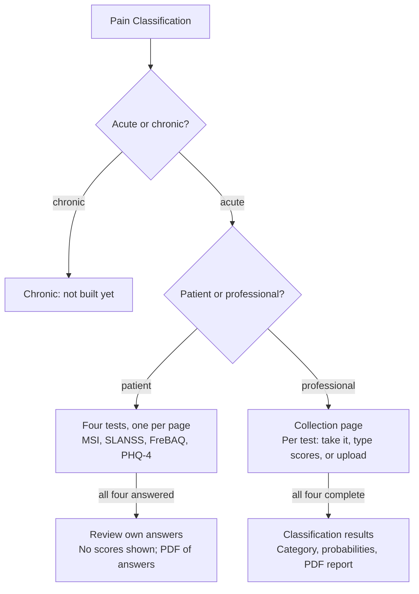

# PATH — Hand-off Guide

September 30, 2026 · Jamie Kim

A shared, commentable copy of this guide lives at
<https://claude.ai/code/artifact/0b9a2ceb-0e8e-4c1e-a198-82dc42cd8b0b>.

## Overview

PATH (Pain Assessment Tools Hub) is a website that lets a patient or clinician complete validated pain and symptom questionnaires, see the scored result immediately, and download it as a PDF report.

Everything runs inside the web browser. Answers, names and scores are never sent to a server, and they are erased when the user leaves an assessment or closes the tab.

| Assessment | What it screens for | Items | Reached from |
| --- | --- | --- | --- |
| Symptom Index (MSI) | Somatic and non-somatic symptom burden | 10 symptoms × 2 ratings | Hub card |
| Body Awareness (FreBAQ) | Disrupted self-perception of the painful body area | 6 | Hub card |
| Pain Classification | Combines the four tests below into one classification | 2 intake questions + 4 tests | Hub card |
| Sensory Profile (briefSLANSS) | Neuropathic pain features | 4 | Inside Pain Classification only |
| Anxiety & Depression (PHQ-4) | Anxiety and depression | 4 | Inside Pain Classification only |

The site is built with Astro and Svelte and hosted on Cloudflare Pages. Each push to the `main` branch of the GitHub repository (Jamie215/PATH) republishes it automatically.

## Design

Every assessment follows the same pattern: a short intake, the questionnaire, then a results page with a PDF download. The hub home page lists the assessments as cards.

**Two audiences.** Before a test, the user says whether they are a patient or a healthcare professional. Professionals see scores, screening flags and the classification. Patients see their own answers but no scores or classification (the exact rule for each test is in its section below).

**Three ways to supply a result** (Pain Classification only):

1. **Take the test** on screen.
2. **Manual entry**: type the sub-scores from a paper test already scored by hand.
3. **Upload completed tests**: a filled PDF, a scan, or phone photos of the printed answer sheets. The app reads the marks and asks a person to confirm them (see *Uploading completed tests*).

**Patient data.** All answers, names and scores are held in the browser's session storage for the current tab only. They are cleared when the user leaves an assessment (for example, back to the hub), which suits shared clinic computers. No server or database exists.

**Reports.** Each results page has a *Patient name / ID* field and a download button that builds a PDF on the device, including the charts shown on screen. Each test also has a printable answer sheet ("Download test") that can be filled by hand or on screen, then uploaded later.

**Look and feel.** The primary colour is purple `#4F2683`. Colours, spacing and type are defined once in `src/styles/global.css`.

**Where the logic lives.** Each test has its own folder under `src/assessments/` holding the question wording (`questions.ts`) and the scoring (`scoring.ts`). A change to wording or cutoffs is normally a one-file edit there. The list of hub cards is `src/assessments/registry.ts`.

## Symptom Index (MSI)

MSI turns 10 symptom ratings into a somatic score (0–60) and a non-somatic score (0–72). The scoring is a direct port of the original Python `msi.py` and is tested against its outputs.

**Workflow**

1. Hub → *Symptom Index* → choose *patient* or *healthcare professional*.
2. For each of the 10 symptoms, rate **frequency**: Never, Rarely, Often, Always. If not *Never*, also rate **bothersomeness**: Barely noticeable, Somewhat, Quite, Extremely. An optional comment box follows.
3. Results page: summary table, symptom charts, and the PDF download. Only professionals also see the two screening flags.

**Scoring logic**

- Each symptom's (frequency, bothersomeness) pair is looked up in a fixed 13-row × 10-column matrix (`msi/matrix.ts`, copied from the original `matrix.csv`). The result is a 0–12 score per symptom. *Never* always scores 0; *Always + Extremely* always scores 12.
- **Somatic** = sum of sharp, dull, stiff, weak, numb (max 60).
- **Non-somatic (central)** = sum of sensitive, numb, fatigue, foggy, nausea, anxiety (max 72). *Numbness* is deliberately counted in both, as in the original.
- Also reported: number of symptoms present (0–10), mean frequency (0–3, over all 10), and mean bothersomeness (1–4, over symptoms present).

| Screening flag (professional only) | Likely | Unclear | Unlikely |
| --- | --- | --- | --- |
| Full recovery predicted | non-somatic ≤ 2 | 3–21 | non-somatic ≥ 22 |
| Potential major depressive disorder | non-somatic ≥ 21 | 10–20 | non-somatic ≤ 9 |

**Target for meaningful change.** The results table shows, for each measure, the current value minus a fixed change threshold (never below 0). The thresholds are 1.8 symptoms, 0.9 mean frequency, 1.0 mean bothersomeness, 7.5 somatic and 6.1 non-somatic. They live in `src/components/MSIResults.svelte`.

## Body Awareness (FreBAQ)

FreBAQ adds up six 0–4 ratings into a total of 0–24; higher means more disrupted perception of the painful area.

**Workflow**

1. Hub → *Body Awareness*. There is no role question; the survey opens directly.
2. The user types the body part bothering them most (e.g. "right knee"). The six statements are then reworded around it, e.g. "My right knee feels as though it is not part of the rest of my body" ("My hands feel … they are …" for plural areas). With no area, they read "The area …".
3. Each statement is rated Never (0), Rarely (1), Occasionally (2), Often (3), Always (4). An optional comment box follows.
4. Results page: the total, a coloured verdict card, and the PDF download.

**Scoring logic**

- Total = sum of the six ratings (0–24). The body area is context only and is not scored.
- The results card is highlighted as *elevated* when the total is **12 or more**, otherwise *normal*. FreBAQ has no firm validated cutoff, so 12 (the upper half of the range) is a placeholder awaiting the PI's confirmation.
- The 0–4 scale matches the version the Pain Classification model was calibrated on.

## Sensory Profile (briefSLANSS)

briefSLANSS counts "Yes" answers to four neuropathic-pain questions (0–4); 3 or more reads as *predominantly neuropathic*.

**Workflow**

1. Normally reached as step 2 of Pain Classification; it is hidden from the hub, though its own page (`/briefslanss/`) still works.
2. Four Yes/No questions: numbness or tingling; skin changes in the area; skin abnormally sensitive to touch; discomfort when lightly rubbing the area compared with a non-painful area.
3. When run on its own, a results page shows the total, the verdict and a PDF download.

**Scoring logic**

- Total = number of *Yes* answers (0–4).
- Total **> 2** (i.e. 3 or 4): "Pain is predominantly neuropathic". Otherwise: "Pain is less likely to be neuropathic". This cutoff is marked as needing the PI's confirmation.

## Anxiety & Depression (PHQ-4)

PHQ-4 sums four 0–3 ratings (0–12) and reports the standard four severity bands.

**Workflow**

1. Normally reached as step 4 of Pain Classification; hidden from the hub, though `/phq4/` still works on its own.
2. Four items over the last two weeks: nervous/anxious/on edge; unable to stop worrying; down/depressed/hopeless; little interest or pleasure. Each is rated Not at all (0), Several days (1), More than half the days (2), Nearly every day (3).
3. When run on its own, a results page shows the total, the band and a PDF download.

**Scoring logic**

| Total | Band shown |
| --- | --- |
| 0–2 | Normal — minimal distress |
| 3–5 | Mild psychological distress |
| 6–8 | Moderate psychological distress |
| 9–12 | Severe psychological distress |

## Pain Classification

Pain Classification feeds five scores from the four tests into a statistical model and assigns one of four pain categories, with a probability for each. Only the acute pathway is built.

**Workflow**

1. Hub → *Pain Classification Assessment* → choose **acute** or **chronic** pain. Chronic currently shows a "needs additional configuration" message and stops.
2. Choose **patient** or **healthcare professional**. The two roles then take different routes (diagram below).
3. **Patient route:** the four tests one per page, in the order Symptom Index → Sensory Profile → Body Awareness → Anxiety & Depression, with Previous/Next. Then a review page lists their answers (no scores or classification), with Edit links and a PDF of the answers to hand to the clinician. A "Download all tests" button gives a single fillable PDF at any point.
4. **Professional route:** a collection page with one card per test. Each card is completed by taking the test in a pop-up, typing the sub-scores, or uploading completed tests. Each card also has an optional comment. *See results* unlocks once all four are complete.
5. **Results (professional):** the predicted category, the probability of each category, the inputs and comments used, the MSI charts, and a PDF download.



Both routes use the same four tests and the same stored answers; only professionals ever see a score.

**Scoring logic** (`pain-classification/scoring.ts`, ported from the "more stable model" workbook)

1. **Inputs.** MSI somatic (0–60), MSI non-somatic/central (0–72), briefSLANSS total (0–4), FreBAQ total (0–24), PHQ-4 total (0–12).
2. **Standardise.** Each input becomes a Z-score by a straight-line mapping from its range to the workbook's Z range (below). Values outside the range are clamped to the ends.
3. **Score each category.** Each category's score is an intercept plus a weighted sum of the five Z-scores.
4. **Probabilities.** A softmax turns the four scores into probabilities that sum to 100%. The category with the highest score is the classification.

```math
P(k) = \frac{e^{s_k}}{\sum_j e^{s_j}}, \quad s_k = b_{k,0} + b_{k,1} z_{somatic} + b_{k,2} z_{central} + b_{k,3} z_{slanss} + b_{k,4} z_{frebaq} + b_{k,5} z_{phq4}
```

| Measure | Raw range | Z at minimum | Z at maximum |
| --- | --- | --- | --- |
| MSI somatic | 0–60 | −2.00415 | 2.55216 |
| MSI central | 0–72 | −1.18272 | 3.32006 |
| briefSLANSS | 0–4 | −1.35666 | 1.79376 |
| FreBAQ | 0–24 | −0.99064 | 3.05668 |
| PHQ-4 | 0–12 | −1.20701 | 1.87713 |

| Category | Intercept | Somatic | Central | briefSLANSS | FreBAQ | PHQ-4 |
| --- | --- | --- | --- | --- | --- | --- |
| Mood-Dominant | 1.8276 | 0.000856 | 0 | −0.9105 | −1.7185 | 2.6417 |
| Localized/Resilient | 3.2222 | −0.3861 | −2.3383 | −0.3207 | −2.0971 | −5.7957 |
| Central/Complex | −6.2004 | 0.4973 | 1.8317 | 0.3153 | 1.5179 | 5.1043 |
| Neurosensory-Dominant | 1.1506 | −0.1121 | 0.3054 | 0.9159 | 2.2977 | −1.9504 |

The workbook also contains TIDS and Brief PCS tables. The model does not use them, so the app omits them.

## Uploading completed tests

On the professional collection page, a completed packet can be uploaded instead of re-entering answers. The app pre-fills what it can read and a person always confirms every test before it is scored.

**What can be uploaded**

| Upload | How it is read |
| --- | --- |
| The fillable PDF, completed on a computer | The ticked answers are read straight from the PDF form fields, so there is no guesswork. |
| A printed sheet, scanned to PDF or photographed | Each page is flattened using the corner markers, then each bubble's darkness is measured. |

**Steps for a scan or photo**

1. **Match each page to a test.** A photo does not say which test it is, so the app reads the page against all four answer sheets and pre-selects the best fit. The reviewer can change it or skip the page.
2. **Read the bubbles.** A clearly filled bubble is pre-filled. Blank questions, or questions with two marks, are flagged rather than guessed.
3. **Read the FreBAQ body area.** The handwritten body part is read by a small handwriting-recognition model that runs on the device. If the writer scribbled over a mistake, the scribble is removed first; if the scribble covers the word, the field is left for the reviewer to type. The comment boxes are not read automatically; they are flagged for typing.
4. **Confirm.** Each test opens in its normal survey, pre-filled, with the scanned image alongside. The reviewer corrects anything and saves. If that test already had answers, the app warns before replacing them.

**Privacy note.** Images and handwriting are processed on the device. The handwriting model file (TrOCR small) is downloaded from Hugging Face the first time it is used; no patient data is sent with that download.

## Open items for the PI

Four decisions are still open.

- [ ] **FreBAQ cutoff.** Confirm 12 or more as the "elevated" highlight, or supply a validated cutoff. It is set in `src/components/FreBAQResults.svelte`.
- [ ] **briefSLANSS cutoff.** Confirm a total above 2 as "predominantly neuropathic". It is set in `src/assessments/briefslanss/scoring.ts`, with the matching colour in `src/components/BriefSLANSSResults.svelte`.
- [ ] **Chronic pathway.** Decide the chronic-pain tests and model. Choosing *chronic* at intake currently stops with a placeholder message.
- [ ] **Model file download.** Confirm that the one-time handwriting-model download from Hugging Face is acceptable for ethics or privacy review, or host the file on the PATH site instead.
